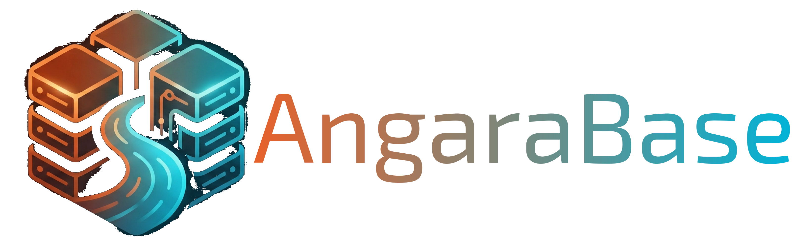

<div align="center">

<picture>
  <source media="(prefers-color-scheme: dark)" srcset="assets/logo_website_dark.png">
  
</picture>

**Analytics cannot degrade your transactions. No ETL. No VACUUM. One binary.**


### 🌐 [angarabase.com](https://angarabase.com) · 📖 [angarabase.dev](https://angarabase.dev) · 🗺 [Roadmap](ROADMAP.md) · 📦 [Releases](../../releases) · 🐛 [Issues](../../issues) · 💬 [Discussions](../../discussions)

</div>

---

## The Problem with Modern Data Stacks

Your backend serves 50 k transactions per minute. Finance wants real-time aggregates. You have three choices — all bad:

**Option A — Postgres only.** Heavy `GROUP BY` queries hold `ShareLock`, VACUUM runs at night and still can't keep up with bloat. p99 latency becomes unpredictable. Engineering scrambles.

**Option B — Postgres + ClickHouse + Kafka/Debezium.** Works until it doesn't. Three systems to operate, a Data Engineering team to keep the pipeline alive, minutes of data lag, and a bill that grows faster than revenue.

**Option C — An existing HTAP database.** Most HTAP systems are "two databases under one roof fighting over the same CPU." A long analytical scan degrades every concurrent transaction. The isolation is marketing, not a contract.

AngaraBase is built to eliminate all three failure modes from a single binary.

---

## Why AngaraBase

### 1. Analytics cannot degrade your transactions — by contract

AngaraBase enforces **named resource boundaries** (CPU slots, memory, UNDO space, write-set size, connections) per workload class. When an analytical query hits its boundary, it gets an explicit `SQLSTATE` error. Your OLTP path continues unaffected — not by luck, but by engine design.

> *Most HTAP databases give you co-location. AngaraBase gives you fail-closed contracts.*

### 2. No VACUUM. Ever.

PostgreSQL's VACUUM is a source of operational pain at scale: heap bloat, autovacuum storms, maintenance windows. AngaraBase uses **UNDO-log MVCC** (the Oracle / InnoDB model): historical row versions live in a separate UNDO log, the heap holds only current rows. There is nothing to vacuum. No bloat accumulates. Snapshot visibility is deterministic.

> *For teams already fighting Postgres bloat and autovacuum tuning — this alone is worth evaluating AngaraBase.*

### 3. Zero-ETL HTAP in a single binary

AngaraBase runs row-store OLTP and columnar SIMD-accelerated OLAP **inside the same process, on the same data**. No Kafka. No Debezium. No ClickHouse cluster. No data lag. One binary on one Linux host.

### 4. No external operational toolchain

Running PostgreSQL reliably at scale requires a stack of auxiliary systems: Patroni + etcd for HA, pgBouncer for connection pooling, ClickHouse + Kafka for analytics, and cluster management tools on top. Each piece has its own failure modes, upgrade cycles, and expertise requirements.

AngaraBase ships with what that stack gives you — but as built-in contracts, not bolt-on tools:

| Capability | Postgres ecosystem | AngaraBase |
|---|---|---|
| OLTP + OLAP | Postgres + Kafka + ClickHouse | Built-in AngaraColumn engine |
| High availability | Patroni + etcd (external coordinator) | Built-in Raft auto-failover *(v0.7)* |
| Event bus / CDC | Kafka + Debezium | Built-in AngaraStream (WAL-based CDC in v0.7) |
| `LISTEN`/`NOTIFY` | Postgres built-in | ✅ Implemented |
| Observability | Third-party exporters | Built-in Prometheus metrics + USDT probes |
| Resource governance | None | Fail-closed contracts per workload class |
| Connection pooling | pgBouncer (separate) | Built-in admission control |

> *The goal: one binary that you can reason about, monitor, and run a runbook against — without a dedicated platform engineering team.*

### How it compares

|  | Postgres + ClickHouse | TiDB | AngaraBase |
|---|:---:|:---:|:---:|
| OLTP + OLAP on same data | ❌ ETL required | ✅ shared CPU | ✅ isolated |
| Analytics cannot degrade OLTP | ❌ | ⚠️ best-effort | **✅ by contract** |
| No VACUUM / no heap bloat | ❌ | ❌ | **✅ UNDO-log** |
| Zero-ETL (no Kafka pipeline) | ❌ | ✅ | **✅** |
| PostgreSQL wire protocol | ✅ | ✅ | **✅** |
| Built-in HA (no Patroni/etcd) | ❌ | ✅ | **✅ *(v0.7)*** |
| Single binary, self-hosted | ❌ (3+ systems) | ❌ (multi-node) | **✅** |
| Operational complexity | High | Medium | Low |

---

## When to use AngaraBase

AngaraBase is designed for workloads where **the cost of one unpredictable latency spike is higher than the cost of switching databases**:

- **Fintech billing & fraud detection** — write millions of transactions and run heavy aggregations for pattern detection in the same instance, without degrading payment processing latency.
- **Real-time operational analytics** — dashboards and reports on live transactional data without an ETL pipeline or data lag.
- **IoT / time-series with joins** — fast ingest and complex aggregations that overwhelm InfluxDB, with none of the Postgres VACUUM overhead at high write rates.
- **Regulated systems of record** — audit trails, ERP cores, compliance data stores where "usually works" is not an acceptable reliability guarantee.

## When NOT to use AngaraBase

Be honest with yourself before switching:

- You need **full PL/pgSQL** or triggers — not implemented yet (v0.7 roadmap for trigger foundation).
- You need the full Postgres extension ecosystem (`pgvector`, `PostGIS`, …) — AngaraBase is pgwire-compatible, not a Postgres fork; third-party extensions do not work.
- You need a **vendor-managed cloud database** (RDS, Cloud SQL, Atlas) with a vendor SLA — AngaraBase requires your own Linux infrastructure (`x86_64` / `aarch64`, `glibc ≥ 2.28`).
- You're running **< v0.7 in unsupervised production** — the current dev preview is suited for pilots and design-partner engagements, not for replacing production Postgres today.

Full compatibility map: [angarabase.dev → SQL Reference](https://angarabase.dev/sql-reference/).

---

## What's in the box

- **PostgreSQL wire protocol (`pgwire`)** — works with stock `psql`, JDBC, `libpq`, `pgx`, `asyncpg`. No
  proprietary driver. No application rewrites. `LISTEN` / `NOTIFY` / `UNLISTEN` supported.
- **UNDO-log MVCC** in the Oracle / InnoDB tradition — no `VACUUM`, no heap bloat, snapshot-deterministic
  visibility.
- **ARIES recovery** (Analysis → Redo → Undo, with CLR) — crash-consistent host migration and PITR through one
  recovery contour.
- **Fail-closed admission control** — eight named resource boundaries (memory, undo, write set, connections,
  …), each surfaced as a Prometheus metric and a unique `SQLSTATE`. The error arrives *before* the incident,
  not after.
- **Pluggable storage engines** behind one `TableEngine` trait — row store, AngaraMemory (three explicit
  durability tiers: `none` / `logged` / `snapshotted`), and AngaraColumn engine (columnar, SIMD-accelerated).
- **Linux-native observability** — Prometheus metrics on every contract boundary, USDT probes for `bpftrace` /
  `perf`, structured logs with stable field names.
- **Built-in security baseline** — `scram` authentication out of the box, RLS / audit / break-glass on the
  roadmap; no behavior is enabled silently.
- **Evidence-gated releases** — every release train closes on a 24-hour soak test and a pinned benchmark.
  Correctness is an artifact in `Releases`, not a marketing claim.

---

## Quickstart (~ 60 seconds)

```bash
# 1. Download and unpack (Linux x86_64 / aarch64, glibc >= 2.28)
#    https://github.com/angarabase/angarabase/releases
sudo mkdir -p /opt/angarabase
sudo tar -xzf angarabase-<version>-x86_64-unknown-linux-gnu.tar.gz -C /opt/angarabase

# 2. Create a dedicated system user and data directory
sudo useradd --system --no-create-home --shell /usr/sbin/nologin angarabase
sudo mkdir -p /var/lib/angarabase
sudo chown angarabase:angarabase /var/lib/angarabase

# 3. Initialize the instance (fail-closed: server will not start without --init)
sudo -u angarabase /opt/angarabase/bin/angarabase-server --init /var/lib/angarabase \
  --superuser angara_root --superuser-password 'change-me' \
  --auth-mode scram

# 4. Run (or wire into systemd — see angarabase.dev → Installation)
sudo -u angarabase /opt/angarabase/bin/angarabase-server \
  --config /var/lib/angarabase/config.toml

# 5. Connect with stock psql — pgwire-compatible, no driver changes needed
psql "host=127.0.0.1 port=5432 user=angara_root dbname=postgres"
```

Once connected — OLTP writes and OLAP analytics in the same instance:

```
psql (15.6, server 0.6.5)
Type "help" for help.

postgres=# -- OLTP: write transactions
postgres=# CREATE TABLE orders (
postgres(#   id      BIGSERIAL PRIMARY KEY,
postgres(#   user_id BIGINT NOT NULL,
postgres(#   amount  NUMERIC(12,2) NOT NULL,
postgres(#   state   TEXT NOT NULL DEFAULT 'pending',
postgres(#   created TIMESTAMPTZ NOT NULL DEFAULT now()
postgres(# );
CREATE TABLE

postgres=# INSERT INTO orders(user_id, amount)
postgres-#   SELECT g, (random() * 1000)::numeric(12,2)
postgres-#   FROM generate_series(1, 100000) g;
INSERT 0 100000

postgres=# -- OLAP: analytical query on live transactional data — no ETL, no pipeline
postgres=# SELECT state, COUNT(*), SUM(amount), AVG(amount)::numeric(10,2)
postgres-#   FROM orders
postgres-#   GROUP BY state
postgres-#   ORDER BY SUM(amount) DESC;
  state  | count  |      sum       |    avg
---------+--------+----------------+-----------
 pending | 100000 | 50012345.67    |    500.12
(1 row)

postgres=# -- Contract: see named resource usage at any moment
postgres=# SELECT * FROM angara_resource_usage();
      resource      | used  | limit  | pct
--------------------+-------+--------+-----
 connections        |     1 |    100 |   1
 heap_mb            |    12 |   8192 |   0
 undo_mb            |     0 |   2048 |   0
 write_set_rows     |     0 |  50000 |   0
(4 rows)
```

> If a resource limit is breached, AngaraBase returns a deterministic `SQLSTATE` error *before* the incident —
> not after. Analytics quota exhaustion does not propagate to your OLTP path.
> See [`docs/PROJECT_PRINCIPLES.md`](docs/PROJECT_PRINCIPLES.md) §1 for the full contract.

Full installation path (RPM / DEB, systemd, native packages) — [angarabase.dev → Installation](https://angarabase.dev/operations/installation.html).

---

## What makes it predictable

1. **UNDO-log MVCC** — historical row versions live in a separate UNDO log; the heap holds only current
   versions. **No `VACUUM`, no heap bloat.** Visibility is snapshot-deterministic.
2. **Fail-closed by contract** — eight named resource boundaries (memory, undo, write set, connections, …),
   each with an explicit `SQLSTATE` and a Prometheus metric. The error arrives *before* the incident, not
   after. See [`docs/PROJECT_PRINCIPLES.md`](docs/PROJECT_PRINCIPLES.md) §1.
3. **ARIES recovery** — Analysis → Redo → Undo with CLR. Crash-consistent host migration and PITR through one
   recovery contour.
4. **Pluggable storage engines** — one `TableEngine` trait: row store, AngaraMemory with three durability
   tiers (`none` / `logged` / `snapshotted`), and AngaraColumn engine for analytics inside the same instance
   (columnar, SIMD-accelerated — HTAP without ETL).
5. **Evidence-gated releases** — every release train closes on a 24-hour soak test and a pinned benchmark. Not
   "probably faster" but a concrete `p99` on concrete hardware, archived in `Releases`.

Concept reference: [angarabase.dev → Concepts](https://angarabase.dev/concepts/).

---

## Proof, not claims

Every strong statement in this README is backed by a verifiable artifact:

| Claim | Where to verify |
|---|---|
| "No VACUUM" — UNDO-log MVCC | [`docs/ARCHITECTURE.md`](docs/ARCHITECTURE.md) §Storage · `contracts/resource_boundaries.rs` |
| "Fail-closed" — error before incident | [`docs/RELIABILITY.md`](docs/RELIABILITY.md) §G1 · `angara_resource_usage()` live output |
| "Analytics cannot degrade OLTP" | [`docs/RELIABILITY.md`](docs/RELIABILITY.md) §G1 — per-workload resource quotas |
| "ARIES crash recovery" | [`docs/ARCHITECTURE.md`](docs/ARCHITECTURE.md) §Recovery · soak evidence in Releases |
| "pgwire compatible" | [`docs/SQL_COMPATIBILITY.md`](docs/SQL_COMPATIBILITY.md) — full compatibility matrix |
| "Evidence-gated releases" | SHA-256 signed tarballs + evidence pack in [GitHub Releases](../../releases) |
| Benchmarks | 🔜 Reproducible benchmark kit ships with v0.7 Open Beta |

---

## Where to find what

| You need | Where |
|---|---|
| **Project website** | [`angarabase.com`](https://angarabase.com) |
| **Documentation** (canonical) | [`angarabase.dev`](https://angarabase.dev) |
| **Installation packages** | [GitHub Releases](../../releases) · [`PACKAGES.md`](PACKAGES.md) |
| **PostgreSQL compatibility matrix** | [`docs/SQL_COMPATIBILITY.md`](docs/SQL_COMPATIBILITY.md) |
| **Reliability guarantees & failure modes** | [`docs/RELIABILITY.md`](docs/RELIABILITY.md) |
| **Design decisions & unique features** | [`docs/DESIGN.md`](docs/DESIGN.md) |
| **Architecture overview** | [`docs/ARCHITECTURE.md`](docs/ARCHITECTURE.md) |
| **Architectural contracts** | [`contracts/`](contracts/) |
| **Project principles** | [`docs/PROJECT_PRINCIPLES.md`](docs/PROJECT_PRINCIPLES.md) |
| **Bugs, questions, feedback** | [GitHub Issues](../../issues) |
| **Discussions, use cases, ideas** | [GitHub Discussions](../../discussions) |
| **Current status & focus** | [`PROJECT_STATUS.md`](PROJECT_STATUS.md) |
| **Announcements (RU)** | [Telegram @angarabase](https://t.me/angarabase) |
| **Announcements (EN)** | X — *coming soon* |
| **Long-reads (RU)** | Habr — *coming soon* |

---

## What's in this repo, what's not

**✅ Here:**

- **Installation packages** via Releases — Linux `x86_64` / `aarch64`, `glibc ≥ 2.28`. Each package contains
  everything needed to run AngaraBase and to rebuild it under the terms of [`LICENSE`](LICENSE).
- **Architectural contracts** — `docs/ARCHITECTURE.md` and `contracts/*.rs` (Rust trait contracts for
  admission control and resource boundaries).
- **Supported SQL subset** and known-issues catalog with `SQLSTATE` codes.

**❌ Not here:**

- **Engine source code in git.** This is intentional: source is delivered inside the installation package
  under [`LICENSE`](LICENSE) terms, in order to keep one canonical distribution and avoid fragmenting forks
  during the early phase of the project.
- **Managed / cloud offering** — self-hosted Linux only, by design.
- **Internal planning corpus, RFC drafts, CI artifacts** — these live in the private development perimeter and
  ship as evidence in releases.

If you want to build AngaraBase from source, take the source package from [Releases](../../releases) — there
is no point cloning this repo for that, the code isn't here by design.

---

## Community and contribution

- 🐛 **Found a bug or regression?** Open an [issue](../../issues) with reproduction steps. How to collect artifacts for a bug report: [angarabase.dev → Support](https://angarabase.dev/reference/support.html).
- 💬 **A use case, question or idea?** Come to [Discussions](../../discussions).
- 📖 **Want to help with documentation?** The canonical AngaraBook is edited in the private perimeter; submit
  corrections via an issue tagged `docs` — accepted edits ship in the next release.
- 🤝 **Design partner?** Reach out via an issue tagged `design-partner` — see the design-partner program on [angarabase.dev](https://angarabase.dev).

We do not accept code PRs into this repository — there is no source here by design. For architectural
proposals, post in [Discussions](../../discussions); accepted ideas go through the internal RFC process and
ship as part of a release train.

---

## Status & Roadmap

`v0.6.x` — **dev preview**. Suitable for supervised research pilots and design-partner engagements; not ready
for unsupervised production.

- Current branch and focus: [`PROJECT_STATUS.md`](PROJECT_STATUS.md)
- **Where we are headed → [`ROADMAP.md`](ROADMAP.md)**
- Releases: [GitHub Releases](../../releases)
- Known limitations and `SQLSTATE` codes: [angarabase.dev → Known Issues](https://angarabase.dev/reference/known-issues.html)

The high-level milestones: **v0.7** — Production-Ready + Open Beta (HA auto-failover, extended SQL, UDFs, CDC);
**v0.8** — single-node hardening + GA prep; **v0.9** — Public GA + Community Edition + transparent sharding.

---

## License

**Current release: [Business Source License 1.1](LICENSE) (BUSL-1.1)**

What this means today:

- ✅ **Use freely** — run, evaluate, build internal systems on top of AngaraBase.
- ✅ **Study the source** — delivered inside the installation package; read and learn from it.
- ❌ **No managed/hosted service** — may not offer AngaraBase as a commercial Database-as-a-Service.
- ❌ **No resale/OEM** — may not embed or resell without a separate agreement.

**Coming: tiered editions with free Community license key**

We are building a three-tier model:

| Edition | Price | Data limit | SLA | Source access |
|---|---|---|---|---|
| **Community** | Free | 100 GB / cluster | GitHub Issues | — |
| **Commercial** | Paid | By agreement | 8×5 support | — |
| **Enterprise** | Paid | Unlimited | 24×7 + dedicated engineer | Git repository |

- License key: auto-issued, annually renewable, **fully offline verification** (air-gap friendly)
- All core features available in Community: HA, sharding, HTAP (AngaraColumn), pgwire
- Government and educational institutions: extended limits on request

Until Community Edition launches, BUSL-1.1 governs all distributions. Questions about licensing or early access → [open an issue](../../issues) tagged `licensing`.

---

<sub>AngaraBase · Linux x86_64 / aarch64 · `glibc ≥ 2.28` · Predictable by contract · [angarabase.dev](https://angarabase.dev)</sub>
